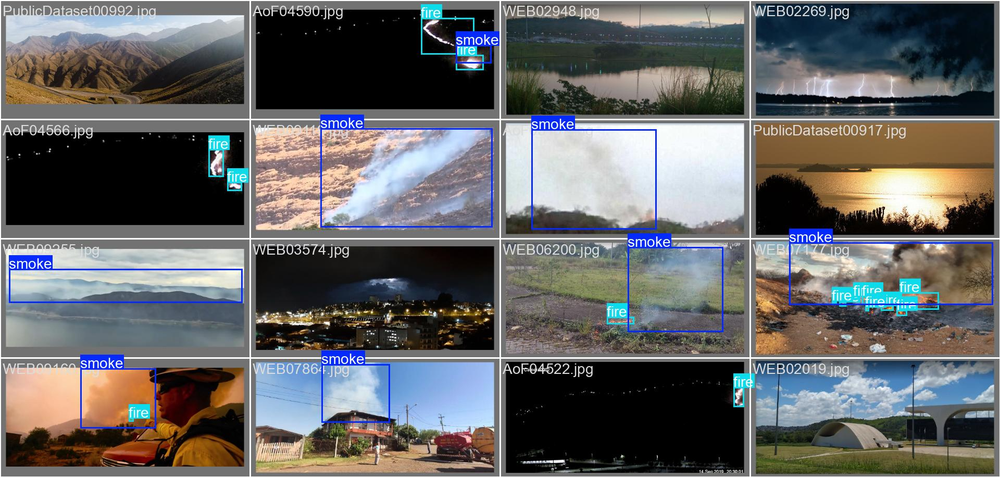

# 🔥 Wildfire Detection using YOLOv8 🚒

YOLOv8을 기반으로 산불(화재) + 연기 이미지를 감지하는 모델을 개발한다.

---

## 진행 현황

### 1. 📊 데이터 준비
- `wildfire-detection` 깃허브 레포지토리의 `training-recipes` 기반으로 프로젝트 구조 구성
- 학습용 이미지/라벨 데이터 준비 완료
- 학습 데이터 경로: `/home/jjh/ML/D-Fire`

---

### 2. 📝 모델 학습
- 모델: YOLOv8n (`ultralytics` 사용)
- 학습 스크립트: `wildfire_training.py`
- 주요 설정:
  - Epochs: 200
  - Batch Size: 64
  - Image Size: 640
  - Early Stopping: 20 epochs
  - Optimizer: Adam
- 학습 환경: 연구실 리눅스 서버, Python 가상환경 (venv)
- 학습 실행: `tmux`를 통해 장시간 학습 안정적으로 실행
- 학습 모델 : 차후 HuggingFace를 통해 업로드 예정

---

### 3. 모델 예측 및 평가
- label이 존재하는 데이터셋과 비교
- 전체적으로 균형잡힌 화재/연기 탐지 및 식별 가능
- 기존에 우려했던 석양, 그림자에 대한 오탐 사례가 거의 보이지 않음.

**예시**

---

- 각종 matrix 및 graph를 통한 정량적 해석은 차후 update 예정

---

### 차후 과제

- 모델과 최적화 함수 및 시각화 서비스와의 파이프라인 구성
- 모델 성능 향상이 필요한가 ? -> 필요하다면 학습전략 구축
- 각종 정량지표 이용 결과 해석 및 보완점 탐색

